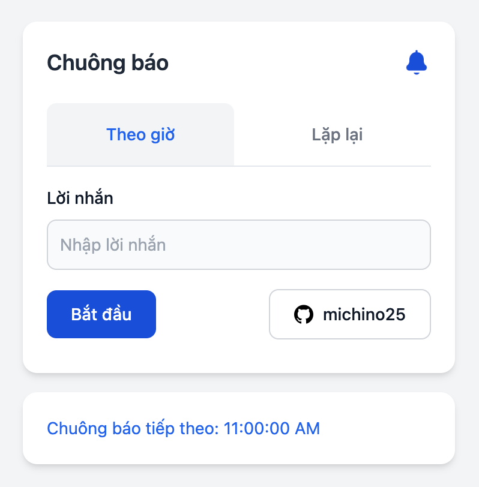
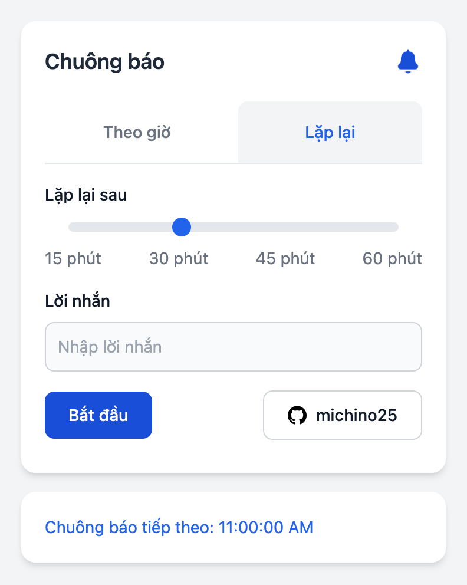

# Chime - Chrome Extension

**Chime** is a Chrome extension that provides time-based notifications with sound alerts, designed to help users take regular breaks, stay hydrated, and manage time effectively. You can set up hourly chimes or recurring reminders at custom intervals.

## Features

- **Hourly Chimes**: Set up hourly notifications with customizable messages.
- **Recurring Reminders**: Receive notifications at intervals of 15, 30, 45, or 60 minutes.
- **Sound Alerts**: Each notification includes a calming, low-toned sound alert to avoid startles and provide a subtle reminder.

<div style="display: flex; flex-wrap: wrap; justify-content: space-around; align-items: flex-start;">
  
  
</div>

## Installation

1. **Clone the repository**:

   ```bash
   git clone https://github.com/michino25/chime-extension.git
   ```

2. **Load the extension into Chrome**:
   - Open Chrome and navigate to `chrome://extensions`.
   - Enable "Developer mode" (toggle switch in the upper-right corner).
   - Click "Load unpacked" and select the cloned `chime-extension` directory.

### Note on Manifest V2

This extension is built using **Manifest V2**. Manifest V3 introduces restrictions (such as offscreen document handling) that affect background tasks and sound playback. For a smoother experience with reliable notifications, Chime will continue to use Manifest V2.

## Usage

1. Click the Chime icon in the Chrome toolbar to open the extension's popup.
2. Choose between **Hourly** and **Recurring** tabs to set up your notifications:
   - **Hourly**: Set a custom message and receive notifications every hour.
   - **Recurring**: Choose an interval (15, 30, 45, or 60 minutes) and set a custom message.
3. Click "Start" to activate the timer. The next notification time will be displayed in the popup.
4. Notifications will appear at the chosen intervals with a sound alert.

## Origin of the Extension

**Chime** was created out of a need for regular, automatic reminders to take breaks, stay hydrated, and manage work intervals effectively. After searching for an application that could provide regular reminders with flexible intervals and custom messages without success, the creator developed this extension to suit these needs.

Chime serves as a helpful tool for short breaks and as a single-interval Pomodoro timer. With recurring reminders, users can take intentional breaks, stand up, and stretch, while a gentle chime reminds them to return to tasks after a set time. The chime sound was carefully selected for a low, soothing tone that avoids startles, providing a moment of calm during transitions.

## Development

To contribute or modify the extension, follow these steps:

1. **Fork the repository** and clone it locally.
2. **Make your changes** to the codebase.
3. **Test the extension**:
   - Reload the extension in Chrome by going to `chrome://extensions` and clicking the refresh icon.
4. **Submit a pull request** with a clear description of your changes.

## File Structure

- **`manifest.json`**: Configuration for the extension, including permissions and background scripts.
- **`popup.html`**: The HTML for the extension's popup interface.
- **`popup.js`**: JavaScript for handling user interactions in the popup.
- **`background.js`**: Background script that manages alarms, notifications, and sound playback.
- **`notification.mp3`**: Sound file for the notification alert.
- **`icons/`**: Directory containing icon files in various sizes (16x16, 48x48, 128x128).

## Permissions

The extension requires the following permissions:

- **`notifications`**: To display notification alerts.
- **`storage`**: To save user settings and next alert times.

These permissions are defined in the `manifest.json` file.

## Contributing

1. Fork the repository.
2. Create your feature branch:

   ```bash
   git checkout -b feature/YourFeature
   ```

3. Commit your changes:

   ```bash
   git commit -m 'Add some feature'
   ```

4. Push to the branch:

   ```bash
   git push origin feature/YourFeature
   ```

5. Open a pull request.

## License

This project is licensed under the MIT License - see the [LICENSE](LICENSE) file for details.

Thank you for using **Chime**! If you encounter any issues, feel free to open an issue or contact us.
